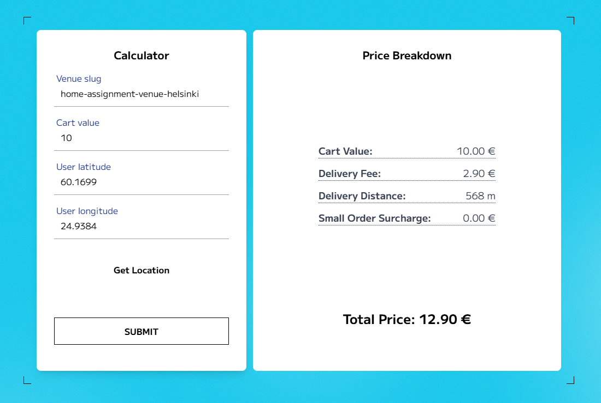

# Wolt Order Price Calculator

A calculator designed to calculate the total price of a Wolt order. This project was created as part of my application for the **Wolt 2025 Frontend Engineering Internship**.



---

## To run:

Navigate to project directory and install dependencies:
```sh
npm install
```

Start the development server:
```sh
npm run dev
```

## Outcome & Reflection 📝:
Unfortunately, I did not progress to the next step of the recruitment process and I didn't receive any feedback on my application ( • ᴖ • ｡)

However, I gained valuable experience in front-end testing.


